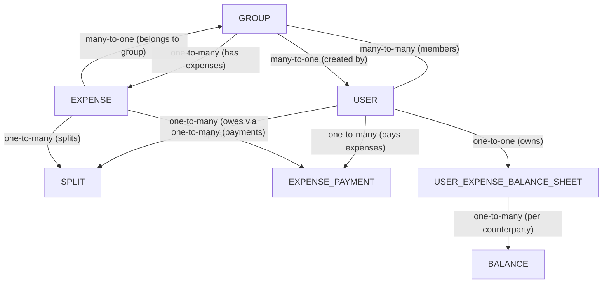

# Splitwise Application

A comprehensive expense splitting application built with Spring Boot, following enterprise-level architecture patterns and best practices.

## Architecture Overview

- **Controller Layer**: REST API endpoints for handling HTTP requests
- **Service Layer**: Business logic and transaction management
- **Repository Layer**: Data access using Spring Data JPA
- **Entity Layer**: Domain models with JPA annotations
- **DTO Layer**: Data Transfer Objects for API requests/responses
- **Strategy Pattern**: For different expense split types

## Features

1. **User Management**: Create, read, update, and delete users
2. **Group Management**: Create groups, add/remove members
3. **Expense Management**: Create expenses with multiple split types
4. **Balance Tracking**: Automatic balance sheet calculation and updates
5. **Split Types**: Support for EQUAL, PERCENTAGE, and EXACT splits


## API Endpoints

### User Management

- `POST /api/users` - Create a new user
- `GET /api/users/{userId}` - Get user by ID
- `GET /api/users` - Get all users
- `PUT /api/users/{userId}` - Update user
- `DELETE /api/users/{userId}` - Delete user

### Group Management

- `POST /api/groups` - Create a new group
- `GET /api/groups/{groupId}` - Get group by ID
- `GET /api/groups` - Get all groups
- `POST /api/groups/{groupId}/members/{userId}` - Add member to group
- `DELETE /api/groups/{groupId}/members/{userId}` - Remove member from group

### Expense Management

- `POST /api/expenses` - Create a new expense
- `GET /api/expenses/{expenseId}` - Get expense by ID
- `GET /api/expenses` - Get all expenses
- `GET /api/expenses/group/{groupId}` - Get expenses by group
- `GET /api/expenses/user/{userId}` - Get expenses by user

### Balance Sheet

- `GET /api/balance-sheets/{userId}` - Get balance sheet for a user
- `GET /api/balance-sheets/{userId}/outstanding` - Get totals you owe vs receive
- `GET /api/balance-sheets/{userId}/summary` - Get net balance summary for a user


## Database Design



- `User` owns one `UserExpenseBalanceSheet` and participates in many `Split` and `ExpensePayment` records.
- `Group` has many `Expense` entries, tracks members through the `group_members` join table, and references a creator `User`.
- `Expense` belongs to a `Group`, aggregates many `Split` rows (who owes) and `ExpensePayment` rows (who paid).
- `UserExpenseBalanceSheet` aggregates many `Balance` rows, each keyed by another user ID indicating how much is owed or receivable.

## Why PostgreSQL (vs MongoDB)

- **Relational graph**: Users, groups, expenses, payments, and balances are tightly linked; SQL joins and normalized tables make these relationships explicit and efficient.
- **Strong integrity**: Foreign keys, unique constraints, and check constraints keep balances consistent and prevent orphaned splits or payments.
- **Transactional safety**: Multi-row, multi-table updates (e.g., creating an expense and updating all member balances) stay ACID-compliant, avoiding partial writes.

## Project Structure

```
src/main/java/com/example/splitwise/
├── controller/          # REST controllers
├── service/            # Business logic
├── repository/         # Data access layer
├── entities/           # JPA entities
├── dto/               # Data Transfer Objects
├── enums/             # Enumerations
├── strategy/          # Split strategy implementations
└── exception/         # Exception handlers
```

## Design Patterns Used

1. **Repository Pattern**: For data access abstraction
2. **Service Layer Pattern**: For business logic separation
3. **DTO Pattern**: For API request/response objects
4. **Strategy Pattern**: For different expense split algorithms
5. **Factory Pattern**: For creating split strategy instances
6. **Builder Pattern**: Using Lombok builders for entity creation